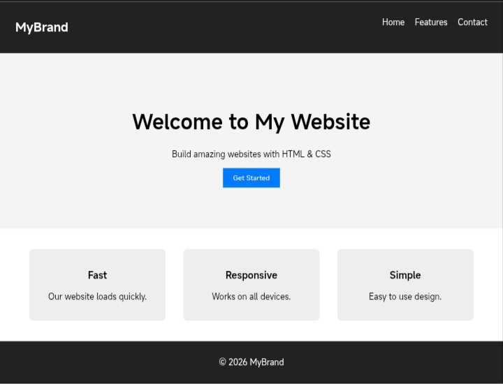

# This is a Landing Page for any Product or Servive Brand
## 📌 Responsive Landing Page
A modern and responsive landing page built using HTML and CSS. This project demonstrates clean layout design, responsive structure, and user-friendly interface suitable for product or service websites.
 
## 🚀 Features
<ul>
<li>Responsive design (mobile, tablet, desktop)</li>
<li>Clean and modern UI</li>
<li>Navigation bar with links</li>
<li>Hero section with call-to-action button</li>
<li>Feature cards section</li>
<li>Footer section</li>
</ul>
 
## 🛠️ Technologies Use
<ul>
<li>HTML</li>
<li>CSS (Flexbox + Media Queries)</li>
</ul>
 
## 📷 Screenshot

 
## 🌐 Live Demo
 
https://itzsohammane.github.io/landing-page/
 
## 📚 What I Learned
<ul>
<li>Building responsive layouts using Flexbox.</li>
<li>Using media queries for different screen sizes.</li>
<li>Structuring a clean and maintainable webpage.</li>
<li>Designing simple and user-friendly UI.</li>
</ul>