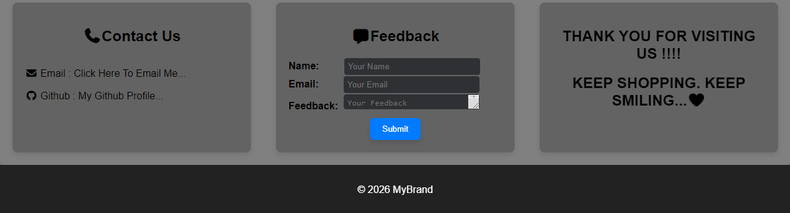

# This is a Landing Page for any Product or service Brand
## 📌 Responsive Landing Page
A modern and responsive landing page built using HTML and CSS. This project demonstrates clean layout design, responsive structure, and user-friendly interface suitable for product or service websites.
 
## 🚀 Features
<ul>
<li>Responsive design (mobile, tablet, desktop)</li>
<li>Clean and modern UI</li>
<li>Navigation bar with links</li>
<li>Hero section with call-to-action button</li>
<li>Feature cards section</li>
<li>Contact Section</li>
<li>Feedback Form</li>
<li>Footer section</li>
</ul>
 
<h3>🛠️ Technologies Us</h3>
<ul>
<li>HTML</li>
<li>CSS (Flexbox + Media Queries)</li>
</ul>
 
<h3>📷 Screenshot</h3>

 
<h3>🌐 Live Demo</h3>
 
 https://itzsohammane.github.io/LandingPage/
 
<h3>📚 What I Learned</h3>
<ul>
<li>Building responsive layouts using Flexbox.</li>
<li>Using media queries for different screen sizes.</li>
<li>Structuring a clean and maintainable webpage.</li>
<li>Designing simple and user-friendly UI</li>
</ul>
